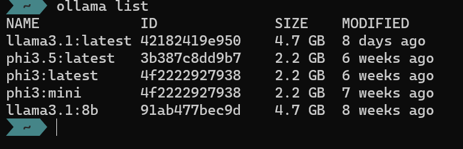

# LLM Code Analyser
An experiment to see how effective an LLM can be in helping to classify and potentially migrate applications to a new platform.

This codebase is primarily targetting non PaaS or cloud hosted models to remove any security concerns of an organisations code (which may contains various secrets or IP) being shared with a public cloud hosted service.
This solution assumes you are using [Ollama](https://ollama.com/) and you have at least 1 model downloaded and able to run. Most of the testing has been performed using Llama3.1 model but it has not been comprehensively tested.

## Table of contents
- [LLM Code Analyser](#llm-code-analyser)
  - [Table of contents](#table-of-contents)
- [Pre-requisites](#pre-requisites)
  - [Ensuring Ollama is accessible](#ensuring-ollama-is-accessible)
    - [Configuring the solution](#configuring-the-solution)
    - [Running inside a devcontainer](#running-inside-a-devcontainer)
- [Running the code](#running-the-code)

# Pre-requisites
1. [Ollama](https://ollama.com/) installed and at least one model like 'Llama3.1' downloaded. Executing 

2. VSCode installed with Python extension
  - However this is not strictly true, but all development has been performed within the devcontainer so many assumptions are already taken care of.
3. A solution to analyse. You can use the source code of this app or you can try something like [replatform-java-webapp-on-aws](https://github.com/aws-samples/replatform-java-webapp-on-aws) from the AWS Samples GitHub repository.

## Ensuring Ollama is accessible
Ollama can be typically accessed via http://localhost:11434 (default - but can be changed - see Ollama documentation). 

To ensure the Ollama is in fact accessible via HTTP, you can execute:
```bash
curl http://localhost:11434
```
If it is running, you should receive:
```
Ollama is running
```
*Note:* If you are executing the command from within the devcontainer, you may need to use the `host.docker.internal` hostname to access the Ollama service running on the host machine. For example:
```bash
curl http://host.docker.internal:11434
```
### Configuring the solution
Set the .env file within the `app` directory with the correct configuration values, use the `.env-sample` as a template. For now, only the `LOCAL_LLM_MODEL_NAME` is used to specify the model to use. 
```
LOCAL_LLM_MODEL_NAME='llama3.1'
```
### Running inside a devcontainer
For the solution to work inside a devcontainer, there is a configuration element in the `.devcontainer/devcontainer.json` file that sets the `OLLAMA_HOST` environment variable. This is used by the code to connect to the Ollama service on `localhost:11434`. If you are using a different host or port, you will need to update this value.
```
"containerEnv": {
    	"OLLAMA_HOST": "host.docker.internal:11434" // OLLAMA_HOST is the hostname of the OLLAMA server - this is to enable use of ollama package inside devcontainer
	},
```

# Running the code
To run the analysis on a solution (prefer Java or python), execute the following:
```bash
cd app
python app.py --solutionpath SOLUTIONPATH
```
Where `SOLUTIONPATH` is the path to the solution you want to analyse. For example:
```bash
python app.py --solutionpath ..
```
This will analyse the solution in the parent directory of the app directory for this solution.

**Important Note:** If you are not using a device with a suitable GPU, this process can take quite some time and consume a lot of CPU.

